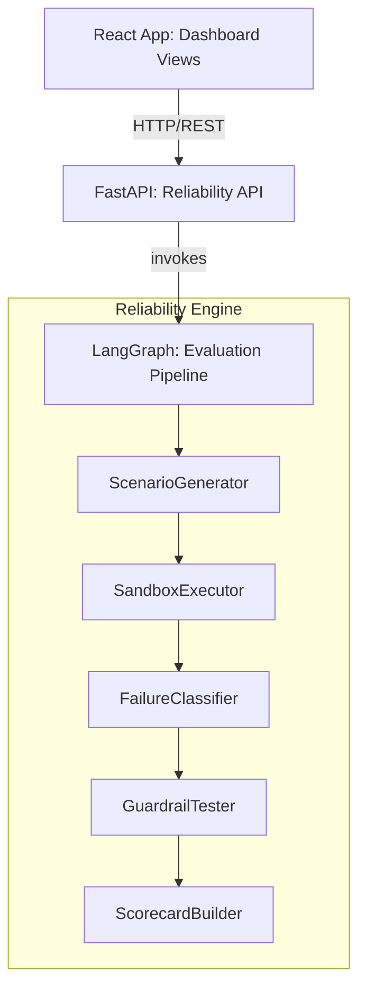
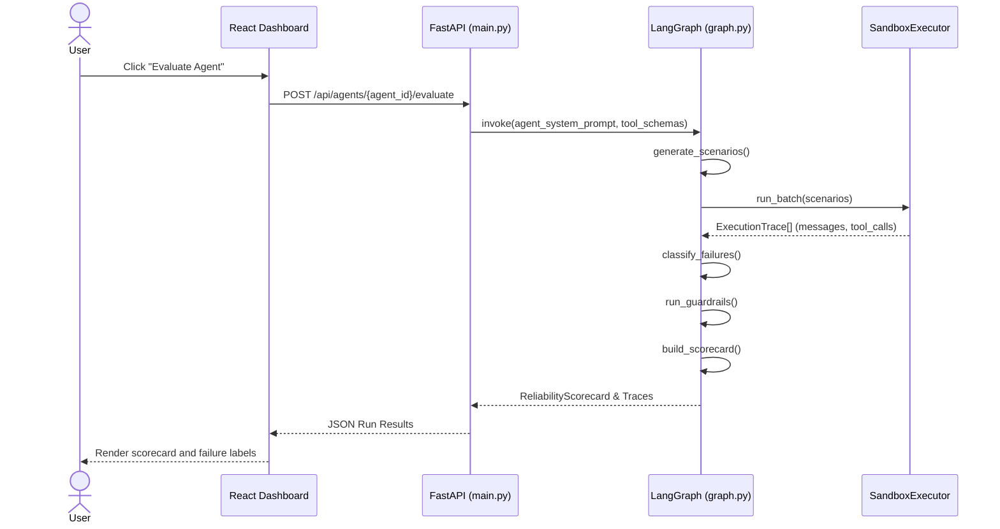

# Agent Reliability Engine

LangGraph-based CI-style reliability evaluation for AI agents with a React dashboard.

<!-- TODO: screenshot or 60s demo GIF here -->

## The Problem
As autonomous AI agents execute tasks, they can fall into tool-call loops, silently drift from their goals, or execute unauthorized destructive actions. Without structured tooling, tracking performance degradation across model versions or testing against adversarial prompt injections is manual and error-prone. Teams need visibility into execution traces to understand exactly why and where an agent failed.

## The Solution
- **Synthetic Test Generation**: Automatically generates Realistic, Adversarial, Ambiguous, and Destructive Pressure scenarios (`osoo/src/reliability_engine/scenario_generator.py`).
- **Sandboxed Execution**: Runs agent tool calls in an isolated, mocked environment to safely capture `ExecutionTrace` objects (`osoo/src/reliability_engine/sandbox.py`).
- **Failure Taxonomy**: Classifies exact failure modes (e.g., `HALLUCINATED_CONFIDENCE`, `SILENT_GOAL_DRIFT`) via an LLM evaluator (`osoo/src/reliability_engine/failure_classifier.py`).
- **Guardrail Testing**: Probes traces for unsafe actions taken without confirmation (`osoo/src/reliability_engine/guardrail_tester.py`).
- **FastAPI Backend & React Dashboard**: Exposes a REST API (`osoo/src/reliability_api/main.py`) consumed by a React interface to visualize scorecard history and regressions (`react-app/src/views/`).

## Architecture Diagram


## How It Works


## Tech Stack
| Layer | Technology | Why |
|-------|------------|-----|
| **Backend API** | FastAPI & Uvicorn | REST endpoints for dashboard and integrations |
| **Evaluation Engine** | LangGraph & LangChain Core | Orchestrates the multi-stage CI pipeline state machine |
| **Data Validation** | Pydantic | Typed schemas for scenarios, execution traces, and scorecards |
| **Frontend** | React 19 & Vite 8 | Component-based view rendering and fast development server |
| **Routing** | react-router-dom | Client-side navigation across evaluation views |

## What Makes This Different
- **Deterministic Pipeline**: Uses a structured LangGraph state machine (`graph.py`) to transition from generation to execution to evaluation, rather than a single massive LLM prompt.
- **Trace-Level Classification**: Evaluates precise `ExecutionTrace` objects with complete tool arguments and timestamps (`models.py`), enabling exact guardrail checks instead of generic string-matching.
- **Pluggable Agent Adapters**: Dynamically loads local agent packages and generates fake tool handlers based on declared schemas (`main.py`), preventing network side-effects during testing.

## Quickstart

```bash
# 1. Start the Backend API
cd osoo
# Install dependencies (using uv or pip)
uv pip install -e .[gemini]
export GOOGLE_API_KEY="your_api_key_here"
agent-reliability-api

# 2. Start the Frontend Dashboard (in a new terminal)
cd react-app
npm install
npm run dev
```

<details>
<summary>Project Structure</summary>

```text
/
├── osoo/
│   ├── agents/                   # Directory for imported local agent packages
│   ├── src/reliability_api/      # FastAPI server and HTTP endpoints
│   ├── src/reliability_engine/   # LangGraph pipeline, classifiers, sandbox
│   └── pyproject.toml            # Python dependencies and CLI scripts
└── react-app/
    ├── src/components/           # Reusable dashboard widgets
    ├── src/views/                # Dashboard routes (Taxonomy, Guardrails, etc.)
    └── package.json              # Frontend configuration
```
</details>

## Challenges & What We Learned
Handling dynamic tool mocking for imported agents required dynamically constructing fake tool handlers (`mock_handlers` in `main.py`) based on schemas exposed by arbitrary `agent.py` adapters. This ensured the SandboxExecutor could run full execution traces without real-world side-effects while still testing the agent's logic flow.

## What's Next
- Implement WebSocket streaming to broadcast execution traces from LangGraph live to the React frontend.
- Expand support for additional LLM evaluator backends beyond Gemini.
- Add customizable vulnerability templates to the `ScenarioGenerator` for domain-specific adversarial testing.

## Team
<!-- TODO: add team members -->
